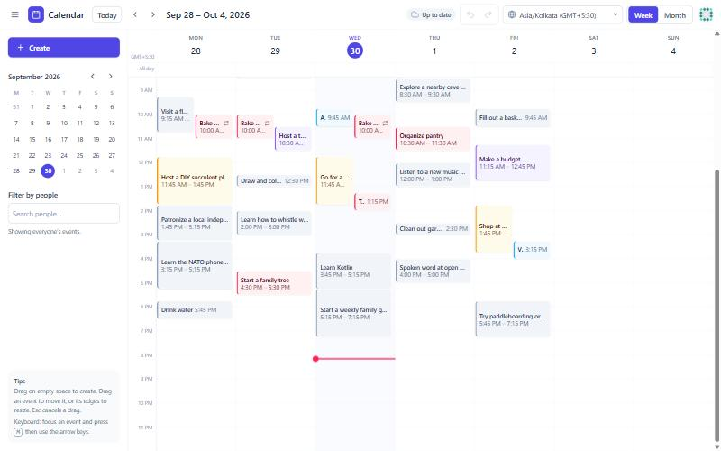
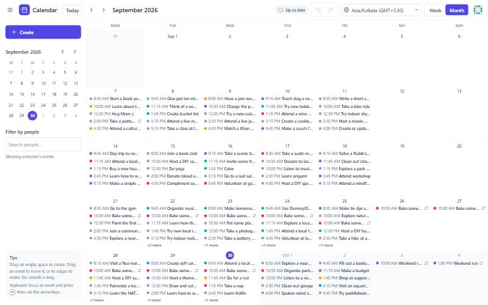
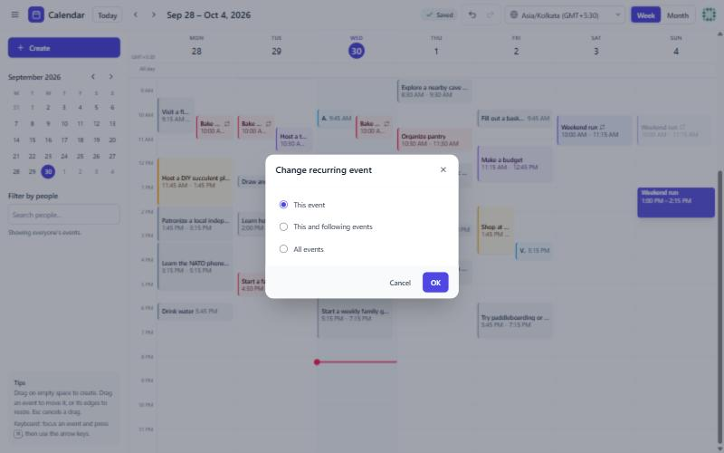

# Calendar Scheduler

A Google-Calendar-style scheduler built with **React 19, Tailwind CSS v4 and Axios** on top of the
[DummyJSON](https://dummyjson.com/docs) API. Log in, then create, drag, resize and repeat events, with full
undo/redo, time-zone switching and a fake sync layer that fails 20% of the time and rolls back cleanly.

**Live demo:** https://calender.pranjalagarwal.me (hosted on Vercel) · **Repo:** https://github.com/pranjal-agarwal01/Calender-Scheduler



| Month view | Editing one occurrence of a recurring event |
| --- | --- |
|  |  |

The design note (state/history, overlap layout, recurrence, persistence, rollback, the hard problem) is in
[`docs/DESIGN.md`](docs/DESIGN.md).

## Setup

Requirements: Node.js 22.12+ and npm.

```bash
npm install
npm run dev        # http://localhost:5173
```

Sign in with any DummyJSON user, for example the public demo account **`emilys` / `emilyspass`** (the login page
has a “Fill demo account” button). Pick a 1- or 2-minute token lifetime on the login page to see the silent token
refresh in action.

| Script | What it does |
| --- | --- |
| `npm run dev` | Vite dev server |
| `npm test` | Unit tests (Vitest) |
| `npm run lint` | ESLint |
| `npm run typecheck` | TypeScript, strict mode |
| `npm run build` | Type-check and build the static site to `dist/` |
| `npm run preview` | Serve the production build |

### Deploying (static hosting)

- **Vercel:** import the repo (framework preset *Vite*). `vercel.json` rewrites every path to `index.html` so
  `/events/:id` and `/calendar?...` survive a refresh.
- **Netlify:** build command `npm run build`, publish directory `dist`. `public/_redirects` does the same SPA
  rewrite.

## Finished features

**Login and session**
- [x] `POST /auth/login` with username, password and `expiresInMins`; clear errors for wrong details or network problems
- [x] Protected routes, logout, session restored on reload with `GET /auth/me`
- [x] Double-click safe (Login, Save and Delete each send exactly one request)
- [x] Logging out in one tab logs out the others (`storage` event); logging in is picked up too

**One shared Axios client** (`src/api/http.ts`)
- [x] Attaches the bearer token; on 401 → **one** `POST /auth/refresh` → retry. Concurrent 401s share the same
  refresh (unit-tested with 5 parallel requests, and demoable from *Developer tools*)
- [x] Every failure is normalised into one `ApiError { code, status, message }`
- [x] API calls live only in `authService`, `userService` and `eventService`

**Calendar**
- [x] Week and month views, previous/next/today, mini-month navigator
- [x] View, date, time zone and attendee filter in the URL (`?view=week&date=2026-10-05&tz=Asia/Kolkata&attendees=1,5`);
  invalid values fall back to safe defaults and the URL is corrected
- [x] Drag on empty slots to create (15-minute snap) → validated form: title, start/end, all-day, attendees,
  recurrence, reminder, colour, description
- [x] Drag to move, drag the top/bottom edge to resize; live preview, **Esc cancels**, one drag = one undo step
- [x] Month view: drag events between days, drag across empty days to create an all-day event
- [x] Keyboard alternative: focus an event, press **M**, arrows move it (Shift+↑/↓ resizes), Enter saves, Esc cancels
- [x] Overlapping events side by side, with a hand-written layout algorithm
- [x] Recurring events: daily, weekly (several weekdays), monthly (day 31, “2nd Tuesday”, “last Friday”); ends
  never / on a date / after N times; edits and deletes ask *this event / this and following / all events*
- [x] Searchable attendee multi-select, built from scratch (ARIA combobox, debounced and cancellable
  `GET /users/search`), with live “already busy” warnings
- [x] Time-zone switcher: times stored in UTC, shown in the chosen zone; DST handled
- [x] Undo/redo for create, move, resize, edit and delete (buttons + Ctrl+Z / Ctrl+Shift+Z)
- [x] `/events/:id` opens a details dialog; refreshing reopens it; unknown ids show “Event not found”;
  attendee profiles load with `GET /users/{id}`
- [x] In-app reminders for your own events

**Data, sync and performance**
- [x] Seeded from `GET /todos` (paged with `skip`, all 254), deterministic times so seeds never move
- [x] localStorage persistence with a schema version, per-event validation and corruption recovery
- [x] Fake sync (~20% failure) with a saving/saved/failed indicator; failures roll back only the failed change and
  leave later undo steps intact
- [x] Race-safe: drag, edit, drag again while a save is pending → the final state matches the last action
- [x] Recurrence instances generated only for the visible range
- [x] Drag state in refs + `requestAnimationFrame`, commit on pointer-up; smooth with 750+ events (see design note)

**Accessibility**
- [x] `role="grid"` with roving-tabindex arrow-key navigation (Enter creates an event in the focused slot)
- [x] Dialogs trap focus, close on Esc and return focus to what opened them
- [x] `aria-live` announcements for moves, saves, undo/redo and rollbacks; descriptive labels on every event

**Developer tools** (account menu → *Developer tools*): change the failure rate (0/20/50/100%), turn on
`?delay=3000` for every DummyJSON call, fire a token-refresh storm, add 500 events, corrupt the saved data to see the
recovery, or reset to the seed.

## How it's built

```
src/
  api/          http.ts (shared Axios client), apiError.ts (single error shape)
  services/     authService, userService, eventService, fakeNetwork (20% failures)
  domain/       pure logic, no React: time/ (Intl-based zones), recurrence/ (expand + edit planning),
                layout/ (overlap + lanes), eventForm (validation), conflicts, seed, urlState
  store/        Zustand stores: calendar (events + history + sync), auth, users, ui, toasts, announcer;
                history.ts (commands + rollback), persistence.ts (versioned localStorage)
  hooks/        useCalendar, useDragInteraction, useHistory, useKeyboardMove, useGridNavigation,
                useFocusTrap, useEventActions, useAttendeeSearch, useConflicts, useReminders, ...
  components/   calendar/ (week, month, blocks), events/ (form, picker, details, scope dialog),
                layout/, ui/, dev/
  pages/        LoginPage, CalendarPage, NotFoundPage
```

No calendar, date, drag-and-drop, data-fetching or state-history libraries: dates use `Date` + `Intl`, state uses
Zustand, and history uses the command pattern.

Tests cover the risky logic: time-zone conversion across DST, recurrence (month ends, nth weekday, counts, DST,
exdates), recurring edits and deletes, overlap layout, undo/redo and every rollback ordering, persistence recovery
the single-flight token refresh, form validation, conflicts and URL parsing.

## Known limitations

- Undo/redo history is kept in memory, so it starts empty after a reload or logout (events themselves persist).
- A save still pending when the tab closes is kept locally but not retried later (there is no outbox).
- DummyJSON saves nothing and ids it creates return 404 later, so events created in the app only exist in the
  browser; `PUT`/`DELETE` are sent for seeded todos only.
- Data is per browser: editing the same calendar in two tabs at once is last-write-wins (only login and logout are
  synced live between tabs).
- Conflict warnings check the time being edited, not every future occurrence of a new series; all-day events count
  as free time.
- “Monthly on day 31” uses the last day of shorter months (Google-style) rather than skipping them as RFC 5545 does.
- Editing an individually changed occurrence with “all events” folds it back into the series.
- Timed events can't be dragged into the all-day row (and vice versa); use the form's *All day* switch.
- On touch screens a tap creates a one-hour event and events can be dragged, but drag-to-create needs a mouse or pen.
- Weeks start on Monday; reminders are in-app notifications while the app is open.
